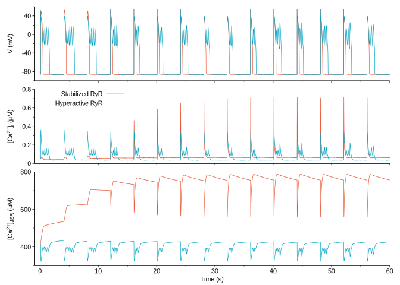

This code is much cleaner. For example, all the transitions of RyR from one state to another are handled by a simple function ```number_RyR_transit``` without any cut-off anymore. It produces the same results as the original code.

**Compile the code**

For the stabilized RyRs
```bash
nvcc cell_stable.cu -O3 -lm -arch sm_30  -o cell -w
```

For the hyperactive RyRs
```bash
nvcc cell_hyper.cu -O3 -lm -arch sm_30  -o cell -w
```

**Run the code**
```bash
./cell 0
```

## Results

